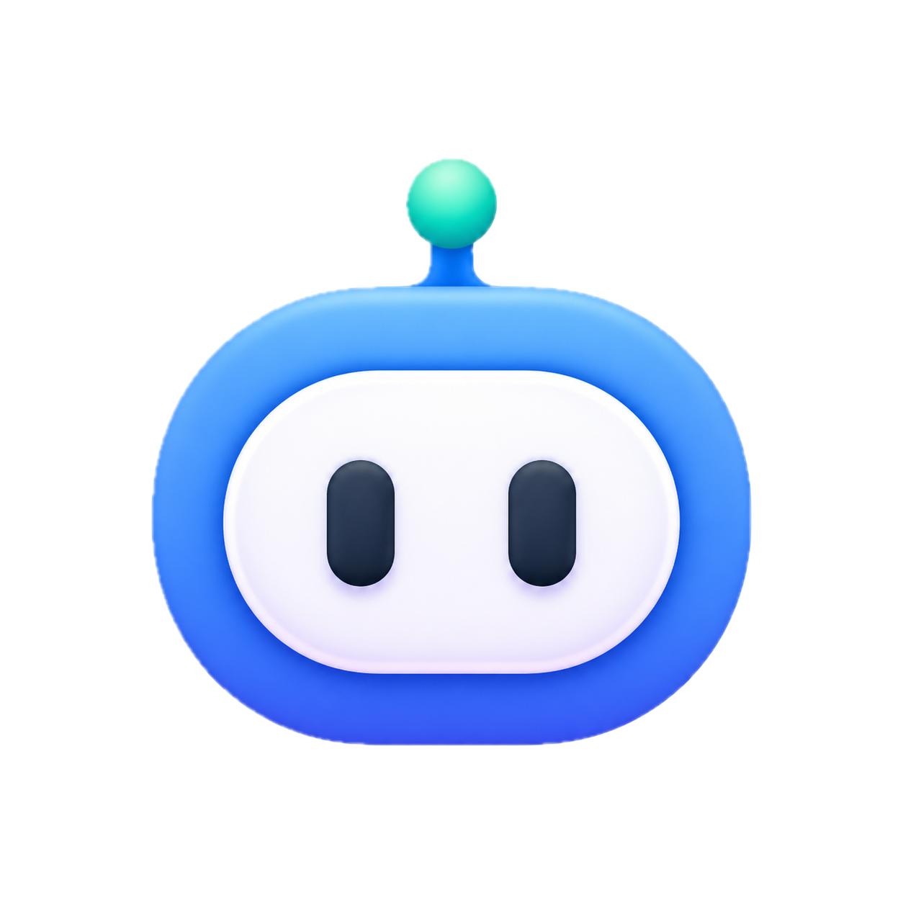

# Funplay

<p align="center">
  
</p>

<p align="center">
  开源桌面端 AI 游戏开发工作台，围绕真实项目文件、引擎上下文和 Agent 工具，把想法推进成可玩的游戏。
</p>

<p align="center">
  <a href="./README.md">English</a> · <a href="./README.zh-CN.md">简体中文</a>
</p>

<p align="center">
  
  
  
  
</p>

Funplay 关心的是：一个游戏想法进入真实项目之后，怎样不被工程细节拖死。它把本地优先的 Electron 工作区、内置多 Provider AI Agent runtime、引擎感知的引导流程、MCP 集成、文件编辑、终端工具、浏览器检查、素材工作流和发布级验证整合在一起。

目标很直接：你描述想做的游戏，连接自己信任的模型和引擎工具，让 Agent 帮你规划、检查、编辑、运行验证、生成素材，并持续把项目推进到可玩的状态。

## 当前状态

- 最新公开版本：[`v0.3.10`](https://github.com/FunplayAI/Funplay/releases/tag/v0.3.10)。
- Runtime：内置 `native` runtime 是当前唯一支持的 Agent runtime。Claude Code SDK runtime 已移除；Anthropic 模型仍通过常规 Anthropic API Provider 支持。
- 引擎：Unity 和 Cocos 已是实装 adapter。Web、Godot、Unreal 目前作为结构化未来目标展示，会返回带 reason / next action 的 unsupported 能力状态。
- 稳定性：Funplay 仍处于 pre-1.0 阶段，Provider 契约、引擎 adapter 和桌面端体验都还在快速迭代。

## Funplay 能帮你做什么

- 把粗略游戏创意拆成可执行的开发计划。
- 让 Agent 在真实本地项目里读取、检查、创建和修改文件，并保留 checkpoint。
- 运行命令、读取日志、检查浏览器预览、搜索文件，并从失败编辑中恢复。
- 使用 OpenAI 兼容 Provider、Anthropic、Google、Bedrock、Vertex 和自定义端点。
- 连接项目绑定的 MCP Server，把工具和资源暴露给 Agent。
- 通过引擎诊断、Bridge 安装、打开项目动作和运行状态检查来处理 Unity 与 Cocos 项目。
- 生成并管理游戏素材，包括图片、UI、纹理、音频、3D 和动画相关任务。
- 在本地保存 Provider 设置、密钥、项目、会话、生成素材和 Agent 运行历史。

## 引擎支持

| 引擎 | 状态 | 当前能力 |
| --- | --- | --- |
| Unity | 实装 adapter | Unity Hub / Editor 诊断、打开项目、安装 Bridge、MCP 连通性、`unity://` 资源读取、运行状态刷新。 |
| Cocos Creator | 实装 adapter | Creator 3 项目导入/创建、2D/3D 引导、安装 `funplay-cocos-mcp`、MCP 连通性检查、`cocos://` 资源读取。 |
| Cocos4 / cocos-cli | 实装 adapter 路径 | 通过 `cocos-cli` 无头创建/打开项目、受管 CLI server、前置条件诊断、受管 MCP 启动。 |
| Web / 通用项目 | 项目检查器 | 文件、浏览器和 HTML 预览工作流；没有引擎 adapter 副作用。 |
| Godot / Unreal | 契约占位 | 返回包含 platform、capability、reason 和 next action 的结构化 unsupported 状态。 |

## Agent Runtime

Funplay 的 native runtime 是一个项目优先的工具循环，编排层不绑定单一模型 Provider：

- Workspace 工具：读取/搜索文件、写文件、应用 patch、multi-edit、运行命令、持久终端、checkpoint。
- Runtime 工具：浏览器检查、Web search/fetch、记忆、通知、媒体附件、文档读取、项目检查。
- MCP 工具：列出/调用工具、读取资源，并在策略允许时把项目 MCP 工具直接 materialize 给 Agent。
- 安全控制：权限 broker、命令沙箱、写入 checkpoint、workspace/engine 副作用后的主动验证、结构化工具结果摘要、可 replay 的 operation log。
- 上下文控制：模型摘要压缩、项目 evidence、近期文件上下文、Provider 能力 registry，以及模型支持 vision 时的多模态输入。
- Subagent：支持 `.claude/agents` 或 `.funplay/agents` 下的本地项目定义、只读 investigator、worker tool pool，以及持久化后台 run 记录。

## 项目结构

```text
electron/main/      主进程服务、IPC handler、持久化和 Agent platform
electron/preload/   暴露 window.funplay 的安全 context bridge
src/                React 19 渲染进程 UI
shared/             跨进程类型和纯共享逻辑
tests/runtime/      Node runtime 单元测试
tests/e2e/          确定性 Agent E2E 任务 fixture
tests/eval/         Agent evaluation 脚手架
scripts/            构建、smoke、benchmark、发布和 native ABI 辅助脚本
resources/          打包资源和 runtime 占位资源
release/            electron-builder 输出目录（gitignored）
```

重要边界：

- `src/` 中的渲染进程代码不能 import `electron/main/`。
- `electron/main/` 中的主进程代码不能 import `src/`。
- 跨进程契约属于 `shared/` 和 `electron/preload/index.ts`。
- 新增 IPC 需要同步更新类型、preload 暴露、主进程 handler 和 Zod 校验。

## 架构

Funplay 有意把编排层和平台集成拆开：

- `electron/main/agent-core/` 负责 runtime 无关状态、controller 转换、replay、Agent Core parts，以及 UI/持久化共用的单一 message stream。
- `electron/main/agent-platform/native/` 负责内置 Provider 循环，覆盖 Anthropic、Google、Bedrock、Vertex、OpenAI-compatible Chat Completions、OpenAI-compatible Responses 和 Anthropic Messages-compatible 端点。
- `electron/main/agent-platform/tools/` 负责注册 Agent 工具及其 risk、permission、checkpoint 和 UI action metadata。
- `electron/main/agent-platform/engine-adapters.ts` 定义 `tools/engine-control.ts` 使用的引擎 adapter contract。
- `src/` 把 Agent Core parts 投影为对话 transcript、执行过程时间线、设置页、素材视图、引擎面板和可 replay 的 run 历史。

目标形态是一条权威的 Agent event stream。UI、operation log、持久化、verification report 和详情面板都是这条流的读侧投影，而不是彼此竞争的账本。

## Provider、MCP、素材与密钥

Funplay 分别支持以下配置：

- 聊天/模型 Provider
- 素材生成 Provider
- 项目 MCP Server
- 引擎 Bridge
- Web Search Provider

API Key 由主进程密钥存储管理，不会发送给渲染进程。渲染进程只能通过 typed `window.funplay` preload bridge 与应用通信。

常用开发环境变量：

- `FUNPLAY_ALLOW_LOCAL_WEB_TOOLS=1` - 允许 Web 工具测试访问本地 URL。
- `BRAVE_SEARCH_API_KEY` / `BING_SEARCH_API_KEY` - 启用 Web Search Provider。
- `FUNPLAY_COCOS_MCP_LOCAL_SOURCE=/path/to/funplay-cocos-mcp` - 开发时从本地 checkout 安装 Cocos bridge。

## 本地开发

安装依赖并启动桌面应用：

```bash
npm install
npm run dev
```

`npm run dev` 会先为正确的 Electron ABI 重建原生依赖，然后启动 Electron Vite。

首次启动建议：

1. 打开应用设置。
2. 添加至少一个 AI Provider。
3. 创建或导入项目。
4. 选择工作流：通用项目、Unity 或 Cocos。
5. 如果是引擎项目，完成 onboarding checklist，并连接 engine bridge / MCP server。
6. 从具体目标开始，例如“做一个可玩的 Web 原型”、“给 Unity 项目添加关卡循环”或“创建一个 Cocos 3D 场景并验证 MCP 连接”。

常用命令：

```bash
npm run dev                 # 启动桌面端开发模式
npm run build               # 重建 native 依赖、类型检查并构建 Electron target
npm run test                # 运行 runtime 测试，并处理 native ABI
npm run test:runtime        # 同一套 runtime 测试的显式脚本
npm run agent:e2e           # 确定性的 scripted-provider Agent E2E 检查
npm run agent:benchmark     # 发布 workflow 使用的 Agent benchmark gate
npm run ui:smoke            # 静态桌面 UI smoke 检查
npm run ui:electron-smoke   # 真实 Electron UI smoke 场景
npm run ui:maturity-gate    # UI 成熟度 gate
npm run runtime:maturity-gate # Runtime 成熟度 gate
npm run release:gate        # 完整本地发布 gate
```

打包相关：

```bash
npm run dist:mac:split
npm run release:verify-mac-updates
npm run dist:win:x64
```

`better-sqlite3` 必须匹配 Node ABI 或 Electron ABI 二者之一。`npm run test:runtime` 会自动处理切换。如果手动运行单个 Node 测试文件，结束后需要恢复 Electron ABI：

```bash
npm run rebuild:native:force
```

## 发布流程

发布由 GitHub Actions 在推送版本 tag 后完成：

1. 更新 `package.json` / `package-lock.json` 版本。
2. 更新 `CHANGELOG.md`。
3. 运行 `npm run build`、`npm test`、`npm run agent:e2e` 和 `npm run release:gate`。
4. 提交并推送 `main`，创建 annotated `vX.Y.Z` tag，再推送 tag。
5. Release workflow 会构建 macOS arm64、macOS x64 和 Windows x64 产物，然后发布 GitHub Release。

Windows 更新元数据期望 `Funplay-Setup-X.Y.Z.exe`；release workflow 也会保留 electron-builder 原始的 dotted installer 名称用于兼容。

## 参与贡献

小而聚焦的 PR 最容易 review。提交 PR 前建议先运行：

```bash
npm run build
npm run test:runtime
```

如果改了 UI，也建议运行：

```bash
npm run ui:smoke
npm run ui:electron-smoke
npm run ui:maturity-gate
```

如果改了打包或发布流程，也建议运行：

```bash
npm run release:audit
npm run release:gate
```

更多仓库边界和 PR 要求见 [CONTRIBUTING.md](CONTRIBUTING.md)。

## License

Funplay 使用 [MIT License](LICENSE)。
