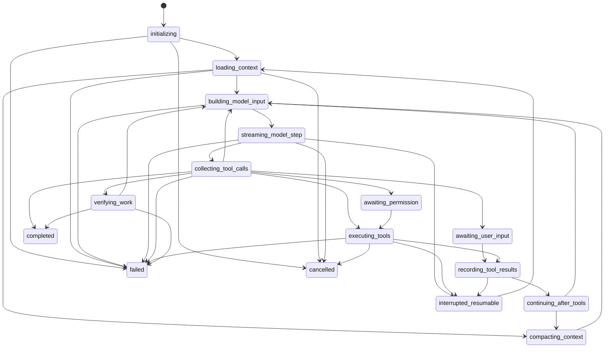

# Agent Core v2 Roadmap

Last updated: 2026-05-15

## Goal

Move Funplay's Agent runtime toward a Claude Code style platform core: a host-controlled state machine, protocol-neutral provider steps, structured message parts, execution-point permissions, stable tool-result replay, resumable interruptions, and transcript rendering driven only by structured parts.

## Maturity Standard

Agent Core v2 is mature when these properties are true:

- The main loop is an explicit state machine.
- Provider adapters emit protocol-neutral step results.
- Assistant text, thinking, tool calls, tool results, permissions, user input, todos, context summaries, usage, and errors are represented as structured parts.
- Tool execution is centralized and permission checks happen only at execution time.
- Tool results are replayed to providers through protocol-specific builders, never by leaking pseudo tool text into assistant replies.
- The loop continues on tool calls and ends only on a real final stop.
- Interrupted runs resume from a stable completed-tool boundary.
- Pending or running tools become structured error parts before replay.
- Context compaction is auditable and preserves goals, constraints, decisions, unfinished work, failed tools, and verification state.
- The frontend transcript renders parts in order and does not parse raw assistant text for tool semantics.

## State Machine

## Structured Parts

| Kind | Purpose |
|---|---|
| `assistant_text` | Visible assistant text in transcript order. |
| `assistant_thinking` | Bounded reasoning/thinking previews where available. |
| `tool_call` | Model-requested tool invocation with stable `toolUseId`. |
| `tool_result` | Successful tool output with structured metadata. |
| `tool_error` | Failed tool output with failure kind and recovery hint. |
| `permission_request` | Host pause for a risky tool execution. |
| `user_input_request` | Host pause for user/MCP elicitation input. |
| `todo_update` | Structured task list state. |
| `context_summary` | Auditable compaction result. |
| `usage` | Provider token usage. |
| `system_event` | State transition or runtime event. |
| `run_error` | Runtime/provider/tool fatal error. |

## Loop Decision Table

| Condition | Outcome | Next State |
|---|---|---|
| User/host cancelled | Cancel | `cancelled` |
| Stable interruption | Pause resumably | `interrupted_resumable` |
| Runtime/provider fatal error | Fail | `failed` |
| Pending permission | Pause | `awaiting_permission` |
| Pending user input | Pause | `awaiting_user_input` |
| Any tool calls, even with provider `stop` | Continue | `executing_tools` |
| Context threshold reached | Compact | `compacting_context` |
| Verification required | Verify | `verifying_work` |
| Provider `stop`, no tool calls, final text present | Complete | `completed` |
| Provider length stop | Continue | `building_model_input` |
| Empty stop with no tool calls and no final text | Fail | `failed` |

## Implementation Route

| ID | Scope | Status |
|---|---|---|
| AC48-1 | Define Agent Core v2 maturity standard, state machine, structured parts, and loop decision table. | Completed |
| AC49-1 | Map existing `ChatContentBlock`, `PromptStreamEvent`, and `AgentRuntimeEvent` into Agent Core parts. | Completed |
| AC50-1 | Add a reusable Agent Core state-machine foundation. | Completed |
| AC50-2 | Wire the OpenAI-compatible Native tool loop through the Agent Core state machine. | Completed |
| AC50-3 | Wire the AI SDK Native loop and Claude runtime through the Agent Core state machine. | Completed |
| AC51-1 | Standardize provider adapters around `AgentCoreProviderStepResult`. | Completed |
| AC52-1 | Centralize tool execution transactions behind a unified Tool Executor. | Completed |
| AC53-1 | Build protocol-specific replay builders from Agent Core parts. | Completed |
| AC54-1 | Make interruption/resume use Agent Core states and stable cursors. | Completed |
| AC55-1 | Upgrade context compaction to emit auditable `context_summary` parts. | Completed |
| AC56-1 | Promote todo/task graph updates into first-class Agent Core parts. | Completed |
| AC57-1 | Move transcript rendering to ordered Agent Core parts. | Completed |
| AC58-1 | Add an Agent Run Debugger view/export based on state transitions and parts. | Completed |
| AC59-1 | Add `agent:core-v2-benchmark` and connect it to the maturity benchmark. | Completed |
| AC60-1 | Switch default Native/Claude runtime paths onto Agent Core v2. | Completed |

## Phase 48 Verification

- Shared platform types: `shared/types/agent-core.ts`
- Decision helpers: `shared/agent-core-v2.ts`
- Regression tests: `tests/runtime/agent-core-v2.test.ts`

## Phase 49 Verification

- Mapping helpers: `chatContentBlocksToAgentCoreParts`, `promptStreamEventToAgentCoreParts`, `runtimeEventToAgentCoreParts`
- Regression tests: `tests/runtime/agent-core-v2.test.ts`

## Phase 50 Progress

- State machine foundation: `createAgentCoreStateMachine`
- Transition validation: `canTransitionAgentCoreState`
- Decision application: `applyDecision`
- OpenAI-compatible Native tool loop state snapshots: `NativeToolLoopRunResult.coreState`
- AI SDK Native tool loop state snapshots: `NativeToolLoopRunResult.coreState`
- Runtime observability: `stage:native_agent_core_v2`, `stage:native_ai_sdk_agent_core_v2`, `stage:claude_agent_core_v2`
- Claude SDK/CLI runtime state tracking now covers context loading, compaction, provider streaming, tool execution, tool-result recording, resume retry, failure, and completion.
- Default Native/Claude conversation completion now persists ordered Agent Core v2 parts for transcript rendering.

## Phase 51 Verification

- Provider-step adapter: `electron/main/agent-platform/provider-step-adapter.ts`
- OpenAI-compatible, AI SDK, and Claude result events now map into `AgentCoreProviderStepResult`.
- Runtime observability stages include the latest normalized provider step next to the Agent Core state snapshot.
- Regression tests: `tests/runtime/agent-provider-step-adapter.test.ts`, focused `agent-runtime.test.ts`

## Phase 52 Verification

- Tool Executor foundation: `electron/main/agent-platform/native/tool-executor.ts`
- OpenAI-compatible Native tool execution now records running/result/completed events through one transaction layer.
- Precomputed malformed-input, duplicate-result, and interrupted-tool outputs use the same transaction result recorder.
- Regression tests: `tests/runtime/native-tool-executor.test.ts`, focused `agent-runtime.test.ts`

## Phase 53 Verification

- Replay builders: `electron/main/agent-platform/agent-core-replay.ts`
- Agent Core parts can now replay into OpenAI-compatible tool messages and AI SDK `ModelMessage` sequences.
- Tool errors replay as protocol tool results instead of assistant pseudo text; context summaries replay as user context messages.
- Regression tests: `tests/runtime/agent-core-replay.test.ts`

## Phase 54 Verification

- Runtime event log now persists `agent_core_state` snapshots emitted by Native and Claude Agent Core v2 stages.
- Runtime run records expose the latest `coreState`, and resume context carries that state alongside the stable completed-tool `resumeCursor`.
- Persisted Agent Core state events map back into ordered `system_event` parts for replay/debug surfaces.
- Regression tests: focused `stream-manager-persistence.test.ts`, focused `agent-core-v2.test.ts`

## Phase 55 Verification

- Runtime event log now persists `context_summary` events from Native and Claude context compression stages.
- Context compression stages include the generated summary and coverage/audit metadata in structured stage input.
- Persisted context-summary events map back into ordered Agent Core `context_summary` parts.
- Regression tests: focused `stream-manager-persistence.test.ts`, focused `agent-core-v2.test.ts`

## Phase 56 Verification

- Runtime event log now persists `todo_update` events whenever `update_todo_list` tool input updates the visible task list.
- Todo updates are normalized into stable id/title/status items independent of provider input alias shape.
- Persisted todo-update events map back into ordered Agent Core `todo_update` parts.
- Regression tests: focused `stream-manager-persistence.test.ts`, focused `agent-core-v2.test.ts`

## Phase 57 Verification

- Completed assistant transcript rendering now prefers `metadata.agentCoreParts` when present.
- Ordered Agent Core assistant text, tool calls/results, context summaries, todo updates, and run errors render without parsing pseudo tool text.
- Regression tests: focused `agent-ui-render.test.ts`

## Phase 58 Verification

- Replay exports now include an `agentCore` debugger payload with latest state, transition history, ordered parts, and part counts.
- Debugger parts are derived from persisted runtime events through the Agent Core part converters.
- Regression tests: focused `agent-run-artifacts.test.ts`

## Phase 59 Verification

- Added `npm run agent:core-v2-benchmark` with focused Agent Core state, replay, persistence, debugger, and transcript checks.
- The deterministic `npm run agent:benchmark` suite now includes the Agent Core v2 maturity slice.
- Regression checks: `npm run agent:core-v2-benchmark`, `npm run agent:roadmap-audit`

## Phase 60 Verification

- Default conversation completion now derives `metadata.agentCoreParts` from runtime `assistantContentBlocks` at the task-executor boundary.
- Native and Claude completed messages therefore use ordered Agent Core assistant text, tool call, and tool result parts by default while preserving existing runtime-provided parts.
- Regression checks: `npm run test:runtime`, `npm run agent:core-v2-benchmark`
